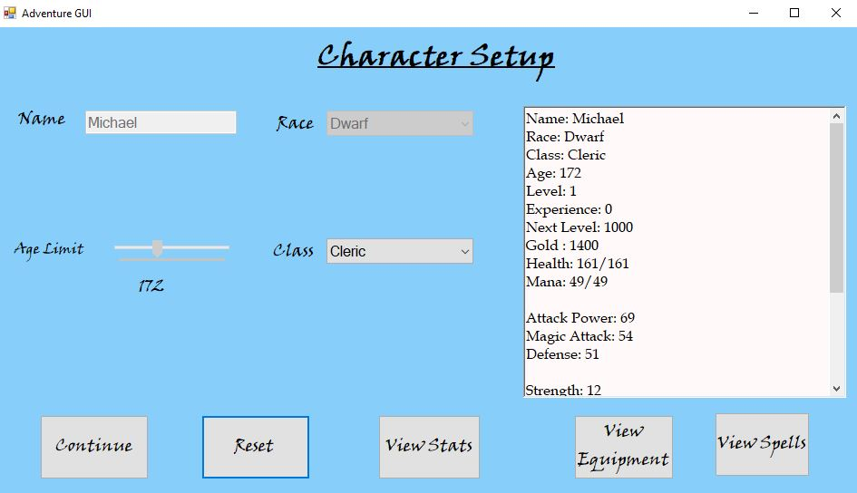

# Character Design - Window's Form's

The point of this program is to utilize capabilitties of the Visual Studio's Windows Form template to set up a Character design page for a text based game.

## Example Output



## Analysis Steps
Main - Create a Character Design Form for setting up a character.
	1)  Start with a Wireframe 
	2)  Start dragging and dropping controls based on the Window's design.
	3)  Make sure logic and functionallity work well
	4)  Make sure Objects are built and displayed correctly.

### Design

How did you approach your program design? Did you use multiple classes to define various objects?


```
There are a few object classes that build the character stats, weapons, armor and spells.  Eventually items will work.  

Also there is the main windows form class that handles the logic for the controls.

```

### Testing

A step by step series of examples that you developed to properly test the program. 

Fill out the form 
```
Make sure the form displays the correct info based upon what user entered.
```

Error Handling
```
Set up logic for when a user doesn't enter information in.  
```

## Notes

I wasn't sure how to transition from one form to another and save all the object information... I think it would have been nice to
use a form as a console and play the script of the game from there.

Otherwise this is a fairly simple Character set up page.

## Do not change content below this line
## Adapted from a README Built With

* [Dropwizard](http://www.dropwizard.io/1.0.2/docs/) - The web framework used
* [Maven](https://maven.apache.org/) - Dependency Management
* [ROME](https://rometools.github.io/rome/) - Used to generate RSS Feeds

## Contributing

Please read [CONTRIBUTING.md](https://gist.github.com/PurpleBooth/b24679402957c63ec426) for details on our code of conduct, and the process for submitting pull requests to us.

## Versioning

We use [SemVer](http://semver.org/) for versioning. For the versions available, see the [tags on this repository](https://github.com/your/project/tags). 

## Authors

* **Billie Thompson** - *Initial work* - [PurpleBooth](https://github.com/PurpleBooth)

See also the list of [contributors](https://github.com/your/project/contributors) who participated in this project.

## License

This project is licensed under the MIT License - see the [LICENSE.md](LICENSE.md) file for details

## Acknowledgments

* Hat tip to anyone who's code was used
* Inspiration
* etc
