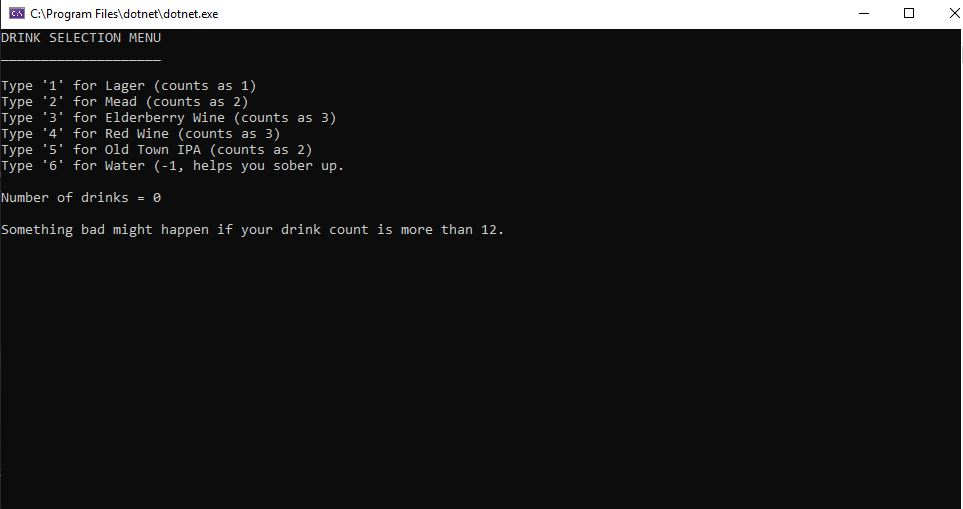

# Text Based Short Adventure - C#

This program explores the opportunites of a terminal based game.  It shows use of objects, arrays, nested loops, Input\Output, all sorts of stuff.

## Example Output



## Analysis Steps
Main - Build a program that plays a little like a game.
	1)  Map out ideas of what user should go through.
	2)  Build functionallity for each peice of logic that the user interacts with
	3)  Make sure Objects are built correctly
	4)  The game should transition form Character set up, Story, Tavern, Battle and Level up.
	
### Design

How did you approach your program design? Did you use multiple classes to define various objects?


```
There are lots of classes.  There are a few for building the objects of the game, some work off of eachother.
Then there are classes for the Script of the game.  
```

### Testing

A step by step series of examples that you developed to properly test the program. 

Run the console and test for console errors.  
```
Character name,age,race,class work correctly and the build object displays correctly.
```

Make sure scenarios based on characters work correctly

```
Run the program and make sure the localization is working fine.
```

Test the Battle System out over an over again

```
Use different characters and make sure no one's over powered.  

```

## Notes

Some of the scripting could have been formated a little better.  There is a lot of potentinal for the ideas
of this program. When I learn more about how to link everything together I'll have a Window's Form GUI to implement this game.
I think this was great practice for myself.

## Do not change content below this line
## Adapted from a README Built With

* [Dropwizard](http://www.dropwizard.io/1.0.2/docs/) - The web framework used
* [Maven](https://maven.apache.org/) - Dependency Management
* [ROME](https://rometools.github.io/rome/) - Used to generate RSS Feeds

## Contributing

Please read [CONTRIBUTING.md](https://gist.github.com/PurpleBooth/b24679402957c63ec426) for details on our code of conduct, and the process for submitting pull requests to us.

## Versioning

We use [SemVer](http://semver.org/) for versioning. For the versions available, see the [tags on this repository](https://github.com/your/project/tags). 

## Authors

* **Billie Thompson** - *Initial work* - [PurpleBooth](https://github.com/PurpleBooth)

See also the list of [contributors](https://github.com/your/project/contributors) who participated in this project.

## License

This project is licensed under the MIT License - see the [LICENSE.md](LICENSE.md) file for details

## Acknowledgments

* Hat tip to anyone who's code was used
* Inspiration
* etc
