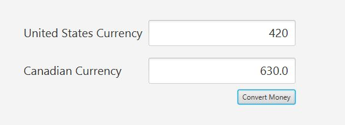

# Project Title

Convert US Currency into Canandian Currency using a GUI and button event.

## Example Output

This image will display as your example output. Name the image README.jpg in your project folder.



## Analysis Steps

Create a GUI program that converts US currency into Canadian currency using javafx.  

1) Create a GUI that displays two textfields and a convert button - used a grid pane
2) Create an action event handler for the button and then create the method later
3) Launch args in the main method and create a simple println statment, just to make sure the call from the event listner works
4) Create logic that converts the American currency(user input) into Canadian Currency
5) Make sure it all displays and works as requried

### Design

How did you approach your program design? Did you use multiple classes to define various objects?

```
At first i thought I would use a borderPane, ended up going with a Gridpane
I ended up using one class.  It was a pretty simple program that did not require too much.  
```

### Testing

A step by step series of examples that you developed to properly test the program. 

Make sure the GUI displays correctly

```
Two textfields, the US one should be the only one that's editable
One Button at the bottorm right
```

Test the button action event

```
See if the Canadian currency changes (should be 1.5 * the US Currcency)
Make sure user can re enter a new value for US and get the correct conversion
```

End with an example of getting some data out of the system or using it for a little demo

## Notes

I had an issue where I was getting the text from both textfields when I should have only been pulling the data from what the user entered.  Ended up fixing that by making a candianRate variable to multiply by the data recieved by the user entry.  Almost thought I'd need a reset method to fix the issue. 

## Do not change content below this line
## Adapted from a README Built With

* [Dropwizard](http://www.dropwizard.io/1.0.2/docs/) - The web framework used
* [Maven](https://maven.apache.org/) - Dependency Management
* [ROME](https://rometools.github.io/rome/) - Used to generate RSS Feeds

## Contributing

Please read [CONTRIBUTING.md](https://gist.github.com/PurpleBooth/b24679402957c63ec426) for details on our code of conduct, and the process for submitting pull requests to us.

## Versioning

We use [SemVer](http://semver.org/) for versioning. For the versions available, see the [tags on this repository](https://github.com/your/project/tags). 

## Authors

* **Billie Thompson** - *Initial work* - [PurpleBooth](https://github.com/PurpleBooth)

See also the list of [contributors](https://github.com/your/project/contributors) who participated in this project.

## License

This project is licensed under the MIT License - see the [LICENSE.md](LICENSE.md) file for details

## Acknowledgments

* Hat tip to anyone who's code was used
* Inspiration
* etc
