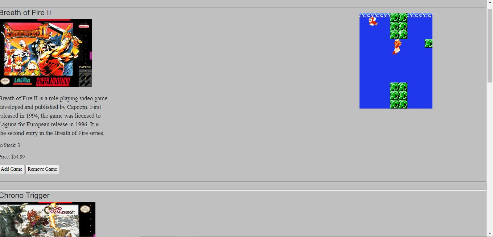

# Vue Shopping Cart

This project is meant to show some basic knowledge of the Vue Framework
## Example Output



## Analysis Steps
Create a Web Page shopping Cart using Vue

1) Create a wireframe of how I want the page to look. 

2) Set up a skeleton HTML page to work with

3) Set up a div to start using vue
	- Place it in the correct spot.
	
4)  Make sure the functionallity works correctly

### Design

How did you approach your program design? Did you use multiple classes to define various objects?

Used an HTML, CSS, and Javascript file for this Project, along with Vue framework.  

```

```

### Testing

A step by step series of examples that you developed to properly test the program. 

Design the web page based on wireframe.

```
Each product has it's own space.

```
Make sure functionallity of each item works.  
```
Each item doesn't affect other items and the out of stock works great.  A final price is also listed.  

```

## Notes

Had issues with one item per row.  I didn't want the web page to display vertically but It was an issue with how I set vue up.  

## Do not change content below this line
## Adapted from a README Built With

* [Dropwizard](http://www.dropwizard.io/1.0.2/docs/) - The web framework used
* [Maven](https://maven.apache.org/) - Dependency Management
* [ROME](https://rometools.github.io/rome/) - Used to generate RSS Feeds

## Contributing

Please read [CONTRIBUTING.md](https://gist.github.com/PurpleBooth/b24679402957c63ec426) for details on our code of conduct, and the process for submitting pull requests to us.

## Versioning

We use [SemVer](http://semver.org/) for versioning. For the versions available, see the [tags on this repository](https://github.com/your/project/tags). 

## Authors

* **Billie Thompson** - *Initial work* - [PurpleBooth](https://github.com/PurpleBooth)

See also the list of [contributors](https://github.com/your/project/contributors) who participated in this project.

## License

This project is licensed under the MIT License - see the [LICENSE.md](LICENSE.md) file for details

## Acknowledgments

* Hat tip to anyone who's code was used
* Inspiration
* etc
