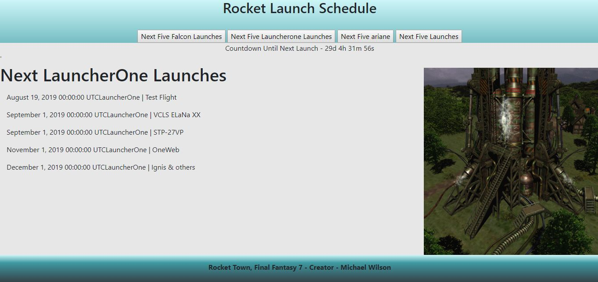

# Rocket Launch API 

The use of this program is to show the use of an API - This will display the next 5 rocket launches pretaining to API Calls.  

## Example Output



## Analysis Steps
Create a Web Page that gives the user an option to click on which rocket schedule they want to and based upon the rocket chosen a list of the schedules get posted on the page.

1) - Create layout of web page
2) - Create an area to display each API Call 
3) - Display a count down for the schedule chosen to next launch.  

### Design

How did you approach your program design? Did you use multiple classes to define various objects?

Used an HTML, CSS and Javascript File.
```

```

### Testing

A step by step series of examples that you developed to properly test the program. 

Click on each Rocket Schedule

```
Make sure different launches are shown along with the countdown time changed.  Make sure these are accurate by going to API website.
```

## Notes

Explain any issues or testing instructions.

The resizeabillity of the web page is a problem.  the elements of the page aren't programmed to fit correctly with resizing. 

## Do not change content below this line
## Adapted from a README Built With

* [Dropwizard](http://www.dropwizard.io/1.0.2/docs/) - The web framework used
* [Maven](https://maven.apache.org/) - Dependency Management
* [ROME](https://rometools.github.io/rome/) - Used to generate RSS Feeds

## Contributing

Please read [CONTRIBUTING.md](https://gist.github.com/PurpleBooth/b24679402957c63ec426) for details on our code of conduct, and the process for submitting pull requests to us.

## Versioning

We use [SemVer](http://semver.org/) for versioning. For the versions available, see the [tags on this repository](https://github.com/your/project/tags). 

## Authors

* **Billie Thompson** - *Initial work* - [PurpleBooth](https://github.com/PurpleBooth)

See also the list of [contributors](https://github.com/your/project/contributors) who participated in this project.

## License

This project is licensed under the MIT License - see the [LICENSE.md](LICENSE.md) file for details

## Acknowledgments

* Hat tip to anyone who's code was used
* Inspiration
* etc
