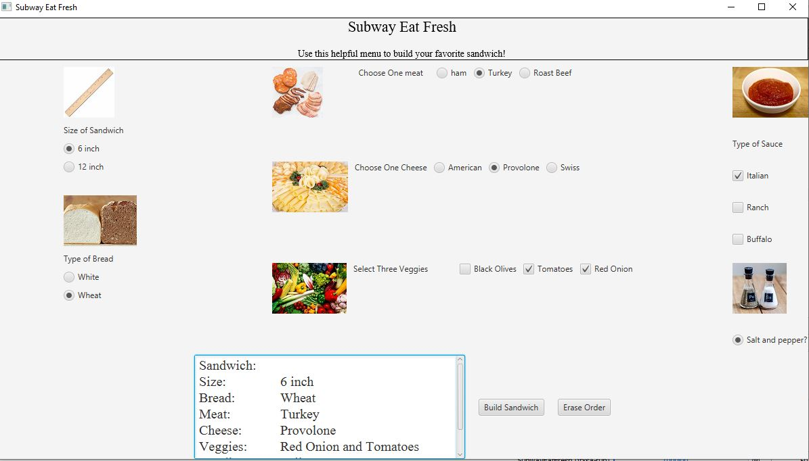

# Subway Sandwhich GUI

This is a program that lets a user build a subway sandwich with various options. It's a GUI and has some intense functionality.  

## Example Output



## Analysis Steps
Create a subway sandwich program in form of a GUI.  

1st  - Make all the options that you want your customers to choose from

2nd -  Design a wireframe based on those options

3rd -  Plan out the GUI and create it

4th - Set up an object to build along with action events 

5th - Think of how users might break the program

6th - Handle the logic to prevent those errors

7th - Test the program

### Design

How did you approach your program design? Did you use multiple classes to define various objects?

We Used one class to build our sandwich

```
public class SandwichObject {

```

### Testing

A step by step series of examples that you developed to properly test the program. 

Try Placing an order without chosing options

```
Don't choose bread type or size.  We have an error message show saying you have to choose bread type and size
```

Try changing options a lot and Observe what the output is after building.  Also check to see if the erase order actually resets the valuse of options selected back to null.

```
Previously we had values that weren't being erase even though the text from the summary was erased. 
```

## Notes
There's one glitch that might happen.  If a user clicks in the textArea after buliding/erasing the order the area might grow.  We invoked summary.isMouseTransparent() to a couple parts of the code.  What that does is it won't let the mouse be active on the element that is covered by the trasnperent property. 

## Do not change content below this line
## Adapted from a README Built With

* [Dropwizard](http://www.dropwizard.io/1.0.2/docs/) - The web framework used
* [Maven](https://maven.apache.org/) - Dependency Management
* [ROME](https://rometools.github.io/rome/) - Used to generate RSS Feeds

## Contributing

Please read [CONTRIBUTING.md](https://gist.github.com/PurpleBooth/b24679402957c63ec426) for details on our code of conduct, and the process for submitting pull requests to us.

## Versioning

We use [SemVer](http://semver.org/) for versioning. For the versions available, see the [tags on this repository](https://github.com/your/project/tags). 

## Authors

* **Billie Thompson** - *Initial work* - [PurpleBooth](https://github.com/PurpleBooth)

See also the list of [contributors](https://github.com/your/project/contributors) who participated in this project.

## License

This project is licensed under the MIT License - see the [LICENSE.md](LICENSE.md) file for details

## Acknowledgments

* Hat tip to anyone who's code was used
* Inspiration
* etc
