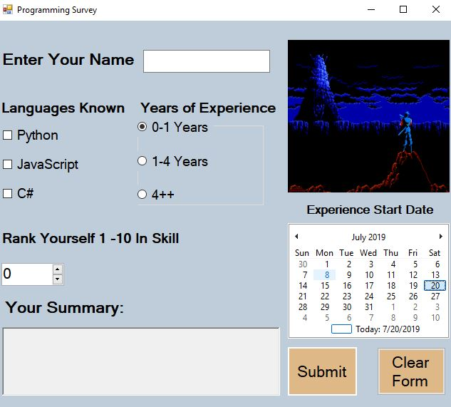

# Programming Survey Form - Window's Form's

The point of this program is to utilize capabilitties of the Visual Studio's Windows Form template to create a Programming Survey Form

## Example Output



## Analysis Steps
Main - Create a Survey form that's realted to Programming.

	1)  Start with a Wireframe 
	2)  Start dragging and dropping controls based on the Window's design.
	3)  Make sure to implement on click for submit button and checkboxes/radio buttons
	4)  Text Area needs to display what the user clicked/typed in. 

### Design

How did you approach your program design? Did you use multiple classes to define various objects?


```
There are two files used.  One is the logic for the action events and the other is for all of code related to the controls placed on the form, built behind the scene.

```

### Testing

A step by step series of examples that you developed to properly test the program. 

Fill out the form 
```
Make sure the form displays the correct info based upon what user entered.
```

Error Handling
```
Set up logic for when a user doesn't enter information in.  
```

## Notes

There could have been more error handling - I could have not let the user click the submit button unless all the fields had information in them. 

The resizeabillity of the web page is a problem.  the elements of the page aren't programmed to fit correctly with resizing. 

## Do not change content below this line
## Adapted from a README Built With

* [Dropwizard](http://www.dropwizard.io/1.0.2/docs/) - The web framework used
* [Maven](https://maven.apache.org/) - Dependency Management
* [ROME](https://rometools.github.io/rome/) - Used to generate RSS Feeds

## Contributing

Please read [CONTRIBUTING.md](https://gist.github.com/PurpleBooth/b24679402957c63ec426) for details on our code of conduct, and the process for submitting pull requests to us.

## Versioning

We use [SemVer](http://semver.org/) for versioning. For the versions available, see the [tags on this repository](https://github.com/your/project/tags). 

## Authors

* **Billie Thompson** - *Initial work* - [PurpleBooth](https://github.com/PurpleBooth)

See also the list of [contributors](https://github.com/your/project/contributors) who participated in this project.

## License

This project is licensed under the MIT License - see the [LICENSE.md](LICENSE.md) file for details

## Acknowledgments

* Hat tip to anyone who's code was used
* Inspiration
* etc
